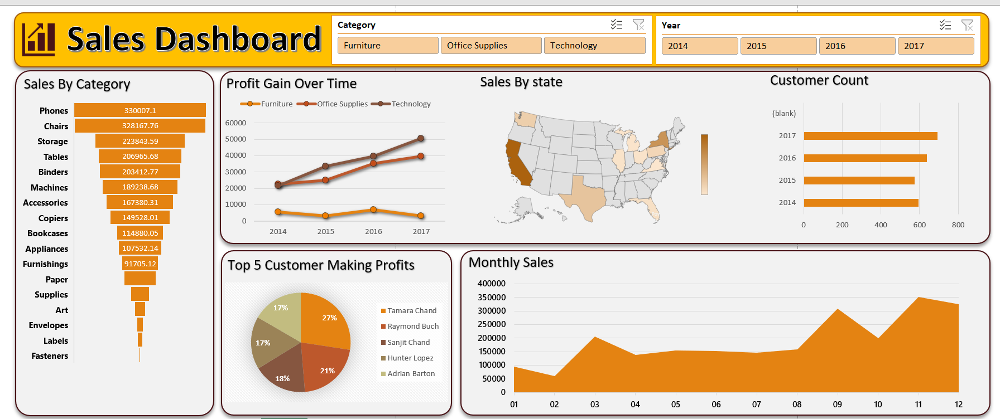

# 📊 Sales Dashboard | Microsoft Excel

An interactive **Sales Dashboard** built using **Microsoft Excel** to analyze sales performance across categories, customers, states, and time periods. The dashboard leverages Pivot Tables, Pivot Charts, Slicers, and Maps to transform raw sales data into actionable business insights.

---

## 📷 Dashboard Preview

> Replace the image below with your dashboard screenshot named **dashboard.png**.



---

# 🎯 Project Objective

The objective of this project is to create an interactive business dashboard that enables users to monitor sales performance, analyze profit trends, identify top-performing customers, and evaluate state-wise sales using dynamic filters.

This dashboard helps convert raw transactional data into meaningful insights for better business decision-making.

---

# 📂 Dataset

**Dataset:** Sample Superstore Sales Dataset

The dataset contains approximately **9,994 sales records** with information such as:

- Order ID
- Order Date
- Ship Date
- Customer Name
- Segment
- State
- Region
- Category
- Sub-Category
- Product Name
- Sales
- Quantity
- Discount
- Profit

---

# ❓ Business Questions

This dashboard answers the following business questions:

- Which product category generates the highest sales?
- How does profit change over different years?
- Which states contribute the highest sales?
- Who are the top five customers based on profit?
- How do monthly sales fluctuate throughout the year?
- How many customers placed orders each year?
- How does sales performance change after applying different filters?

---

# 📌 Key Performance Indicators (KPIs)

- 📈 Sales by Category
- 💹 Profit Trend Over Time
- 🗺️ State-wise Sales Analysis
- 👥 Customer Count
- 🏆 Top 5 Customers by Profit
- 📅 Monthly Sales Trend

---

# ⚙️ Project Workflow

### 1️⃣ Data Collection

- Imported the Superstore Sales dataset into Microsoft Excel.

### 2️⃣ Data Cleaning

- Removed duplicate records
- Checked missing values
- Formatted date columns
- Verified data consistency

### 3️⃣ Data Preparation

- Created Pivot Tables
- Organized data for reporting
- Built summarized business metrics

### 4️⃣ Dashboard Development

Designed an interactive dashboard using:

- Pivot Tables
- Pivot Charts
- Slicers
- Filled Map Chart
- Pie Chart
- Line Chart
- Bar Chart
- Area Chart
- Excel Shapes & Icons

### 5️⃣ Dashboard Interactivity

Implemented dynamic filters using slicers:

- Category
- Year

Users can instantly explore different business perspectives by applying filters.

---

# 📊 Dashboard Insights

### 📦 Sales by Category

- Phones recorded the highest sales.
- Chairs and Storage are among the best-performing categories.
- Fasteners, Labels, and Supplies contribute the least sales.

### 📈 Profit Trend

- Technology consistently generated the highest profits.
- Office Supplies showed stable year-over-year growth.
- Furniture generated comparatively lower profits.

### 🗺️ State-wise Sales

- California is the highest revenue-generating state.
- Texas and New York also contribute significantly to overall sales.

### 👥 Customer Analysis

The dashboard identifies the **Top 5 customers** contributing the highest profits, helping businesses focus on high-value customers.

### 📅 Monthly Sales Trend

Sales increase significantly during the final quarter of the year, indicating strong seasonal demand.

---

# 💡 Business Recommendations

- Focus marketing efforts on high-performing categories.
- Strengthen customer retention strategies for top customers.
- Improve sales strategies in underperforming states.
- Optimize inventory before peak sales months.
- Increase promotional campaigns for low-performing categories.

---

# 🛠️ Tools & Skills Used

### Tools

- Microsoft Excel

### Excel Features

- Pivot Tables
- Pivot Charts
- Slicers
- Filled Maps
- Data Cleaning
- Dashboard Design
- Conditional Formatting
- Data Visualization

### Skills Demonstrated

- Data Analysis
- Business Intelligence
- Dashboard Development
- Data Cleaning
- Data Visualization
- Business Reporting
- Analytical Thinking

---

# ✨ Dashboard Features

- Interactive Dashboard
- Dynamic Slicers
- Category Filter
- Year Filter
- State-wise Sales Visualization
- Monthly Sales Analysis
- Customer Profit Analysis
- Business Insights

---

# 📁 Repository Structure

```
excel-sales-dashboard/
│
├── README.md
├── dashboard.png
├── sales-dashboard.xlsx
├── salesdata.csv
└── LICENSE
```

---

# 🚀 Future Improvements

- Add KPI Cards (Total Sales, Total Profit, Orders)
- Automate data refresh using Power Query
- Include Regional Sales Analysis
- Build a Power BI version of the dashboard
- Add Customer Segmentation Analysis

---

# 👨‍💻 Author

**Jai Bhagwan**

**Data Analyst Intern**

📧 Email: **jjangir836@gmail.com**

💼 LinkedIn: **(https://www.linkedin.com/in/jai-bhagwan-3a0891214/)**

⭐ **If you found this project useful, don't forget to give it a Star!**
